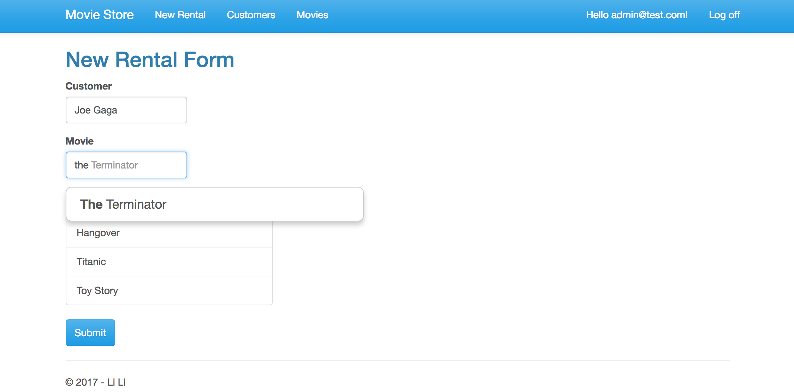

# Movie Store Rental System

This project created a dynamic website for an online movie store rental system. Anonymous users can browse the movie/customer list, while administrator can do CRUD functions on the movies/customers and add new rentals.

Demo site hosted on Azure: https://mvcmoviestore.azurewebsites.net/

### Achievement
- Used Code first approach to create data models using Entity framework 6
- Created RESTful Service using ASP.NET Web API
- Built Responsive UI on client side with jQuery and Bootstrap
- Implemented both client side and server side validations
- Applied authentication and authorization using ASP.NET Identity
- Enabled OAuth for Facebook social acount login

### Technologies
- ASP.NET MVC 5
- Entity framework 6
- HTML5, CSS3, JavaScript, jQuery, Bootstrap
- C# Programming with LINQ
- Version control with Git in development
- Deployment to Azure Web Service

### Tools
- Visual Studio 2017
- SQL Express LocalDB
- IIS express
- NuGet Package Manager
- GitHub extension in VS2017
- Windows Azure platform

### Installation instructions

Requirements:

- Visual Studio 2017
- SQL Server Express LocalDB (to run locally)

To run the sample locally from Visual Studio:
- Download the source code and open the solution file in Visual 
Studio
- Build the solution.
- Open the Package Manager Console (Tools > NuGet Package 
Manager > Package Manager Console)
- In the Package Manager Console window, enter the following 
command: Update-Database
- Press F5 to debug

